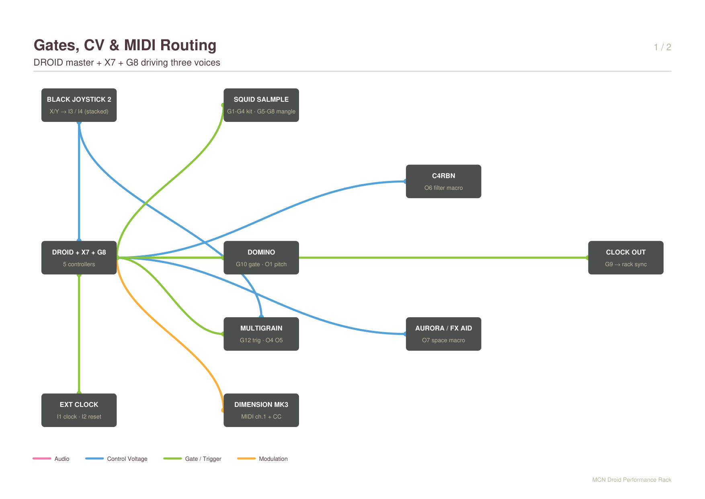
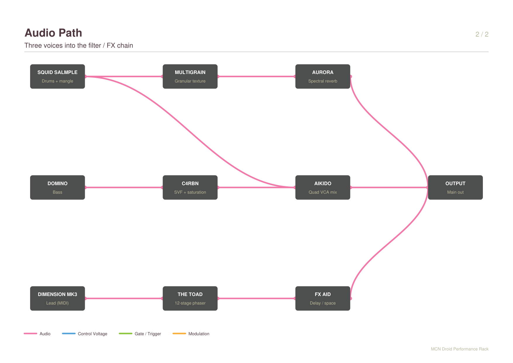
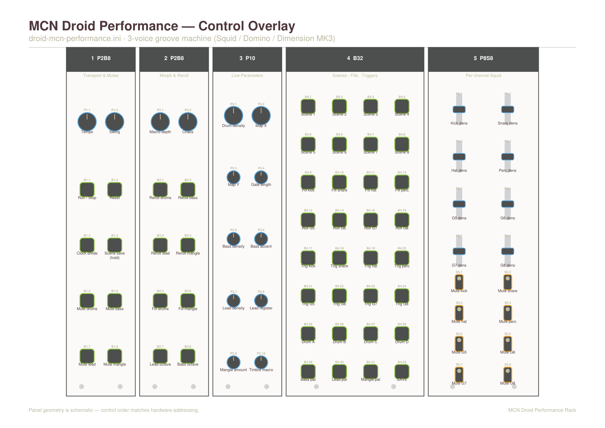

# MCN Droid Performance Rack — Patch Design

**Date:** 2026-09-12
**Target file:** `droid-mcn-performance.ini`
**Rack:** MCN Droid performance rack (ModularGrid #3087024)

A three-voice performance groove machine driven entirely from one DROID master:
drums and sample mangling on the Squid Salmple, bass on the Domino, and a
melodic lead sent over MIDI to the Ziqal Dimension MK3.

---

## 1. Hardware

### Controllers (chain order = addressing order)

| # | Controller | Role |
|---|---|---|
| 1 | `p2b8` | Transport & mutes |
| 2 | `p2b8` | Morph & reroll |
| 3 | `p10` | Live parameters (2 large + 8 small pots) |
| 4 | `b32` | Scenes, fills, manual triggers |
| 5 | `p8s8` | Per-channel Squid sliders + mute switches |

Declaration order in the `.ini` must match the physical left-to-right chain, as
laid out in the rack (P2B8 at col 1, P2B8 at col 6, P10 at col 11, B32 at col
16, P8S8 at col 26).

### Expanders

Verified against a working G8 + X7 patch and the `blue-6` circuit reference:

- **Expanders are not declared.** Only controllers get `[...]` blocks. A
  reference patch using both a G8 and X7 (for `[midiin]`) declares only its
  `p2b8` controllers. Note `droid-polimaths.ini` in this repo declares `[x7]`,
  which does not follow that convention.
- **Gate outputs are numbered continuously across expanders**, G8 first:
  `G1`–`G8` on the G8, then `G9`–`G12` on the X7 (the X7 has four gate outs).

So the physical wiring maps as:

| Physical | Address |
|---|---|
| G8 gates 1–8 → Squid | `G1`–`G8` |
| X7 gate 1 → clock out | `G9` |
| X7 gate 2 → Domino | `G10` |
| X7 gate 3 → (spare) | `G11` |
| X7 gate 4 → Multigrain | `G12` |

---

## 2. Routing

| Jack | Destination |
|---|---|
| `G1`–`G4` | Squid: kick / snare / hat / perc |
| `G5`–`G8` | Squid: mangle slots (ratchets, stutters, chance one-shots) |
| `G9` | Clock out to the rack (X7 gate 1) |
| `G10` | Domino gate (X7 gate 2) |
| `G12` | Multigrain grain/slice trigger (X7 gate 4) |
| `O1` | Domino pitch (quantized, with slide) |
| `O2` | Domino accent |
| `O3` | Domino filter / mod |
| `O4`–`O5` | Multigrain position / size (from the joystick macro) |
| `O6` | Global filter macro (C4RBN / Dimension) |
| `O7` | Space macro (Aurora / FX AID) |
| `O8` | Accent bus |
| MIDI TRS ch.1 | Dimension MK3: pitch + gate + velocity, CC1/CC2 |
| `I1` / `I2` | External clock / reset (internal LFO normalled when unpatched) |
| `I3` / `I4` | Joystick X / Y — stacked, also feeding Multigrain directly |

### Audio path

The audio side is patched by hand and is shown for reference only — the DROID
touches it solely through the `O6` / `O7` macros.

---

## 3. Control surface

Printable version: `modular-patches/patch-sheets/examples/mcn-droid-performance-overlay.yaml`
(render with `python droid_overlay.py examples/mcn-droid-performance-overlay.yaml`).

### Controller 1 (p2b8) — Transport & mutes
| Control | Function |
|---|---|
| `P1.1` | Tempo |
| `P1.2` | Swing |
| `B1.1` | Run / Stop (LED = running, `startvalue = 1`) |
| `B1.2` | Reset (momentary) |
| `B1.3` | Clock divide (multi-state) |
| `B1.4` | Scene save — hold, then press a scene button |
| `B1.5`–`B1.8` | Mute drums / bass / lead / mangle |

### Controller 2 (p2b8) — Morph & reroll
| Control | Function |
|---|---|
| `P2.1` | Macro depth (how far the joystick moves things) |
| `P2.2` | Chaos |
| `B2.1`–`B2.4` | Reroll drums / bass / lead / mangle |
| `B2.5`–`B2.6` | Fill drums / fill mangle (momentary) |
| `B2.7`–`B2.8` | Lead octave / bass octave |

### Controller 3 (p10) — Live parameters
| Control | Function |
|---|---|
| `P3.1` | Drum density |
| `P3.2` / `P3.3` | Map X / Map Y (drum engine morph) |
| `P3.4` | Gate length |
| `P3.5` / `P3.6` | Bass density / bass accent |
| `P3.7` / `P3.8` | Lead density / lead register |
| `P3.9` | Mangle amount |
| `P3.10` | Timbre macro |

### Controller 4 (b32) — Scenes, fills, triggers
Row-major, 4 columns × 8 rows:

| Buttons | Function |
|---|---|
| `B4.1`–`B4.8` | Scenes 1–8 |
| `B4.9`–`B4.12` | Fills: kick / snare / hat / perc |
| `B4.13`–`B4.16` | Rolls: G5 / G6 / G7 / G8 |
| `B4.17`–`B4.24` | Manual triggers for G1–G8 |
| `B4.25`–`B4.28` | Drum pattern banks A–D |
| `B4.29`–`B4.31` | Bass / lead / mangle pattern select |
| `B4.32` | SAVE (hold + scene = store) |

### Controller 5 (p8s8) — Per-channel Squid
| Control | Function |
|---|---|
| `P5.1`–`P5.8` | Per-channel density for G1–G8 |
| `S5.1`–`S5.8` | Per-channel mute for G1–G8 |

---

## 4. Voice engines

### Drums — Squid, `G1`–`G4`
Topographic (Grids-style) engine reused from `droid-mi-grids.ini`. `P3.1` sets
density; `P3.2`/`P3.3` morph the map, and the joystick adds a live offset to
both, scaled by `P2.1`. Per-channel density sliders on the P8S8 bias each
channel around the global value.

### Mangle — Squid, `G5`–`G8`
Euclidean (`[euklid]`) patterns at clock multiples, gated by `P3.9` (mangle
amount) and burst-multiplied by the roll buttons via `[burst]`. These are the
slice / stutter / re-trigger gates for loops and textures.

### Bass — Domino, `G10` + `O1`–`O3`
Acid-style line: `[algoquencer]` with `dejavu = 1` for a remembered pattern,
`[minifonion]` quantizing to the global key/scale, `[slew]` for probabilistic
slide, and an accent bus that drives both `O2` and the filter CV `O3`.

### Lead — Dimension MK3 over MIDI
`[midiout]` on channel 1, TRS. Confirmed parameter shapes from the blue-6
circuit reference:

- `pitch1` takes **1 V/oct**, not MIDI note numbers (range −2 V = note 0 to
  8.583 V = note 127), so the lead shares the same `[minifonion]` quantizer as
  everything else.
- `gate1` — positive edge is note-on, negative edge note-off.
- `velocity1` — 0.0 to 1.0, sampled at the note-on edge; driven from the accent
  bus.
- `cc1` / `ccnumber1` and `cc2` / `ccnumber2` — wavetable position from `P3.10`
  and joystick Y.

---

## 5. Scene system

Scenes are a **capture-and-recall** system, not a full snapshot: a knob-based
DROID cannot restore pot positions, so scenes store values and the pots stay
live as offsets. Nothing jumps on recall.

Each of the 8 scenes stores:

- the **8 Squid mute states**, packed into one CV by `[dac]` (bit1–bit8 → one
  value), stored in a single `[sample]` per scene, and unpacked on recall by
  `[adc]`. This costs about 17 circuits instead of the 64 that eight separate
  per-mute sample banks would need.
- **4 macros**: drum density, chaos, bass density, timbre.

Recall is a `[buttongroup]` over `B4.1`–`B4.8` feeding `[switch]` circuits;
capture is `B4.32` (hold) + scene button, triggering the `[sample]` circuits for
that scene.

---

## 6. Build order

1. Controller declarations, I/O header comment block, transport section
   (internal LFO normalled to `I1`, run/stop, reset, clock divide, `G9` clock out).
2. Drum engine → `G1`–`G4`, with P8S8 density and mutes.
3. Mangle engine → `G5`–`G8`, rolls and fills.
4. Bass engine → `G10`, `O1`–`O3`.
5. Lead engine → `[midiout]`.
6. Macro bus: joystick `I3`/`I4` → `O4`–`O8` and engine offsets.
7. Scene capture/recall.
8. Docs: `patch-guide.md` section and a README table row.

---

## 7. Open decisions

Recorded as assumptions — say the word and they change before the build:

1. **Drum engine** — Grids-style topographic for `G1`–`G4` (musical, maps
   naturally onto the joystick) with Euclidean for `G5`–`G8`. The alternative is
   Euclidean throughout: more predictable and easier to edit live, less groove.
2. **Scene scope** — 8 mutes + 4 macros. Adding the pattern/bank selections
   would make scenes behave like real song sections, at the cost of more
   circuits and RAM.

---

## 8. Sources

- Circuit parameter reference (auto-generated from the DROID `blue-6` manual):
  [Eising/droid-metapatch](https://github.com/Eising/droid-metapatch)
- G8 + X7 gate numbering in a working patch:
  [jpgsloan/supergrids](https://github.com/jpgsloan/supergrids)
- X7 specification (four gate outputs, MIDI DIN + USB):
  [Der Mann mit der Maschine X7](https://shop.dermannmitdermaschine.de/products/x7)
- Diagram and overlay generators: `lostculture/modular-patches`,
  `patch-sheets/generator.py` and `patch-sheets/droid_overlay.py`
